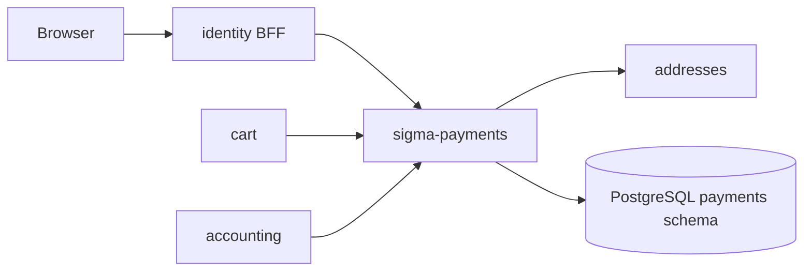

# sigma-payments architecture

`sigma-payments` stores payment methods and records deposit charges for Sigma Tactical Group identity users. It validates billing addresses through the addresses service and exposes a session-gated UI plus an internal JSON API consumed by cart and accounting.

## Context

This service owns the PostgreSQL `payments` schema: `payment_methods`, `charges`, and `refunds`.

## Runtime shape

The `sigma-payments` binary validates configuration, connects `PaymentStore` to PostgreSQL, then hands `sigma_payments::routes(store)` to `sigma_theme::warp::serve`. The theme crate supplies the Warp server, shared static assets, security headers, and the listen address from `PORT`.

This is a demo payment registry, not a PCI card processor: it stores brand, last four digits, and expiry only.

## Request flow

`routes()` combines session-gated web routes from `web.rs` with internal JSON handlers from `api.rs`. `sigma_theme::warp::site_routes` supplies `/up`, static assets, and error recovery; health routes report database connectivity.

Web routes let signed-in users add, edit, delete, and set default payment methods. The internal API serves `GET /api/users/{user_id}/payment-methods`, `POST/GET /api/charges`, and `POST /api/charges/{id}/refund`. Cart checkout charges key on `order_id` for idempotency; declined cards return `402` with the charge body.

## Code map

| Path | Responsibility |
| --- | --- |
| `src/main.rs` | Validates config, connects the store, and starts the server. |
| `src/lib.rs` | Assembles web UI, internal API, health, theme, and CSP routes. |
| `src/config.rs` | Reads public URLs, addresses internal URL, and optional cart badge URL. |
| `src/store.rs` | Payment methods, charges, and refunds persistence. |
| `src/model/` | Method types, charge status, refund records. |
| `src/web.rs` | Session-gated HTML UI. |
| `src/api.rs` | Internal-token JSON API for methods and charges. |
| `src/templates/` | Askama forms and list pages. |

## Data

PostgreSQL schema `payments` holds payment method rows scoped by `user_id` and charge/refund rows keyed by payment reference (`order_id` from cart). `billing_address_id` is validated over HTTP against addresses, not as a database foreign key.

## Configuration

| Environment variable | Purpose |
| --- | --- |
| `PORT` | Listen port supplied to the theme crate. |
| `PAYMENTS_PUBLIC_BASE_URL` | Canonical public URL of this payments service. |
| `PAYMENTS_IDENTITY_PUBLIC_URL` | Identity BFF URL for session checks and navbar links. |
| `PAYMENTS_CONTACT_PUBLIC_URL` | Contact-service URL for the shared chrome. |
| `PAYMENTS_CART_PUBLIC_URL` | Cart-service URL for the shared chrome. |
| `PAYMENTS_ADDRESSES_INTERNAL_URL` | Internal addresses API for billing-address validation. |
| `PAYMENTS_ADDRESSES_PUBLIC_URL` | Public addresses URL for “add billing address” links. |
| `PAYMENTS_IDENTITY_INTERNAL_URL` | Cluster-internal identity URL for session status checks. |
| `PAYMENTS_CART_BASE_URL` | Optional internal cart URL for the navbar item-count badge. |
| `DATABASE_URL` | PostgreSQL connection URL for the shared Sigma database. |

## Deployment

`Dockerfile` produces the `sigma-payments` image. The platform deployment is at `../platform/services/payments/base/deployment.yaml`; it exposes container port `8080` through `../platform/services/payments/base/service.yaml` on service port `80`.

The public VirtualService and environment overlays reside beside the base manifests under `../platform/services/payments/`. Production hostname and platform context are documented in [`../platform/README.md`](../platform/README.md).

## Testing

Run `cargo test -p sigma-payments`. Integration tests in `src/lib.rs` cover `/up` and unauthenticated redirect to login. Tests use `sigma_pg::test_helpers::ready_store`.

## Design notes

- Charges are idempotent per `order_id`; cart retries replay the original charge.
- Refunds compensate when cart cannot commit `deposit_paid` after a successful charge.
- Accounting reconcile sweeps `GET /api/charges` against receipt records.
